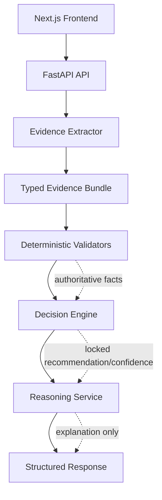
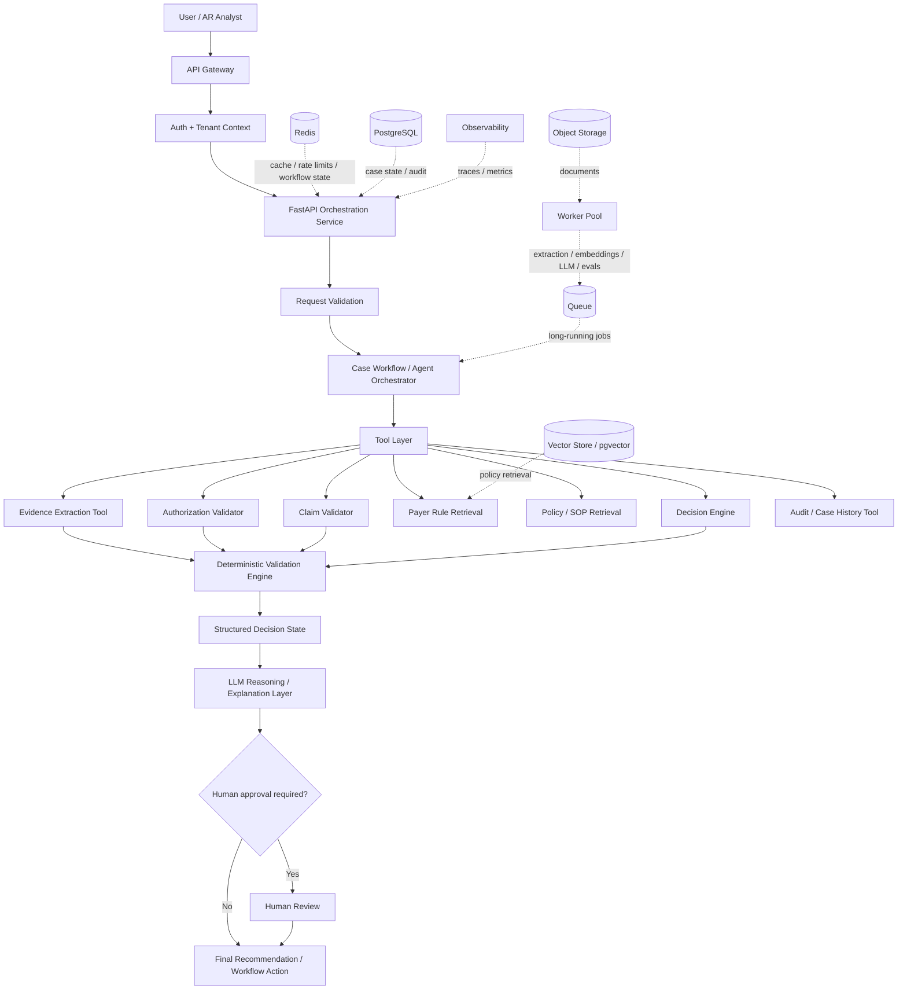

# Denial Navigator AI

Denial Navigator AI is a focused hiring-challenge demo for validating healthcare claim denials. It takes synthetic denial/EOB text and optional authorization evidence, extracts structured fields, validates facts deterministically, and returns a grounded recommendation such as reprocess, corrected claim, or manual review.

## The Problem

Healthcare denial codes alone often do not determine the correct next action.

For example, `CO-197` may indicate missing authorization, but an authorization may actually exist. An analyst still has to verify:

- payer
- member
- provider
- CPT/service
- date of service
- authorization dates
- evidence completeness

The goal of this project is to demonstrate a safer decision-validation approach: extract evidence, validate facts, detect contradictions, and only then explain the result.

## Why I Built This

This problem comes from practical experience with US healthcare revenue cycle and denial workflows. Denial handling is often repetitive, evidence-heavy, and risky when systems jump too quickly from a denial code to a recommendation. I wanted this demo to show how AI can support the workflow while keeping factual validation grounded and auditable.

## What The Demo Does

```txt
Synthetic denial/EOB text
-> evidence extraction
-> typed evidence bundle
-> deterministic validation
-> decision engine
-> grounded explanation
-> structured response
```

The demo focuses on authorization-related `CO-197` denials. It uses synthetic data only.

## Demo Scenarios

1. Valid authorization -> `reprocess`
2. Authorization exists but DOS is outside authorization range -> `manual_review`
3. Missing authorization evidence -> `manual_review`
4. CPT mismatch -> `corrected_claim`
5. Payer, provider, or member mismatch -> `manual_review`

## Architecture



The reasoning service receives already-validated facts. It cannot override the deterministic decision, evidence statuses, contradictions, confidence, or human-review routing.

## Production AI / Agentic Architecture

Proposed production evolution — not implemented in the challenge demo.

The current demo is deterministic-first. In production, an LLM or agent layer could safely sit around the deterministic validation engine as an orchestrator, not as the source of truth.



The agent would follow a bounded workflow: analyze the claim, check required evidence, retrieve payer policy if needed, call authorization and claim validators, inspect contradictions, produce a recommendation, and request human approval for risky or uncertain cases.

Production guardrails would include an explicit workflow graph, approved tool list, max steps, max tool calls, timeouts, deterministic terminal states, and human escalation. LangGraph or a similar orchestration framework could be used, but it is not implemented in this challenge demo.

Scaling would use stateless FastAPI instances behind a load balancer/API gateway, Redis for cache/rate limits/short-lived workflow state, queues for long-running document and AI jobs, autoscaled workers, PostgreSQL for durable case state, object storage for documents, and a vector store or `pgvector` for retrieval if RAG becomes justified.

Production observability would track trace ID, tenant ID, model and prompt versions, rule-set version, retrieval document IDs, tool calls, latency, token usage, decision, confidence, and human overrides. It should avoid logging PHI or raw patient content.

## Key Design Decision: LLM Is Not The Source Of Truth

Facts such as authorization validity, date comparisons, CPT matching, payer matching, provider matching, missing evidence, and contradictions are validated using deterministic code.

The optional LLM path is only used to explain validated facts in clearer language. The default mode is deterministic. If LLM mode is enabled but the call fails, times out, or returns malformed output, the system falls back to deterministic reasoning.

## Hallucination Controls

- Pydantic schema validation for request and response objects
- source-tracked evidence fields
- deterministic validation for factual matching
- unsupported-denial handling with `supported: false`
- human-review routing for unsafe or incomplete cases
- explicit missing-evidence detection
- explicit contradiction detection
- deterministic confidence scoring
- LLM fallback to deterministic reasoning

## Evaluation

The project includes a synthetic golden evaluation dataset with 12 cases.

Current synthetic eval results:

```txt
Recommended Action Accuracy: 100%
Human Review Accuracy: 100%
Contradiction Detection: 100%
Missing Evidence Detection: 100%
Field Validation Accuracy: 100%
Overall Golden Case Pass Rate: 100%
```

These metrics are from a synthetic evaluation set and do not represent production performance.

Golden datasets are useful because they make expected behavior executable. They catch regressions when extraction, validation, decision logic, or failure handling changes.

Production AI evaluation would expand beyond this synthetic golden set. Extraction would be measured with field-level precision/recall, exact match, date accuracy, CPT accuracy, and authorization-number accuracy. Retrieval, if added, would use Recall@K, Precision@K, MRR, NDCG, metadata-filter accuracy, and citation coverage. Decision evaluation would track action accuracy, human-review accuracy, contradiction detection, missing-evidence detection, and false-safe-action rate. False-safe-action rate is especially important because confidently recommending an incorrect action is worse than escalating to a human.

LLM evaluation would measure groundedness, faithfulness, hallucination rate, citation correctness, structured-output validity, instruction following, and completeness. Agent evaluation would measure task success, correct tool selection, unnecessary tool calls, tool failure rate, loop/timeout rate, average steps, and human escalation accuracy.

## Failure Handling

The system is tested for safe behavior when it receives:

- malformed requests
- malformed dates
- empty EOB text
- missing EOB text
- unsupported denial codes
- missing required evidence fields
- LLM timeout
- malformed LLM response
- reasoning service exception

In these cases, the app should return a safe 422 error or a structured manual-review response. It should not invent evidence.

## Tech Stack

Frontend:

- Next.js
- React

Backend:

- FastAPI
- Pydantic
- Python

Testing:

- pytest
- synthetic golden evaluation dataset

Optional reasoning:

- deterministic mode by default
- optional LLM mode for explanation only

## Running Locally

Run the API:

```bash
cd apps/api
python3 -m venv .venv
source .venv/bin/activate
pip install -r requirements.txt
uvicorn app.main:app --reload --port 8000
```

Run the frontend:

```bash
cd apps/web
npm install
npm run dev
```

Open:

```txt
http://localhost:3000
```

## Running Tests

```bash
python3 -m pytest
```

## Running Evaluations

```bash
python3 scripts/run_evals.py
```

## Repository Structure

```txt
apps/
  api/                  FastAPI extraction, validation, reasoning, and decision service
  web/                  Next.js demo UI
demo-data/
  synthetic/            synthetic demo fixtures only
docs/                   architecture, evaluation, and design notes
scripts/
  run_evals.py          golden dataset evaluation runner
tests/
  api/                  API and failure-handling tests
  evals/                golden dataset and eval gates
```

## Tradeoffs

1. Synthetic text instead of real PHI: keeps the public challenge safe and shareable.
2. Deterministic validation over LLM-first decisioning: makes factual matching auditable.
3. One denial family instead of many: demonstrates depth on `CO-197` rather than shallow broad coverage.
4. Labelled text extraction instead of OCR: keeps focus on evidence reasoning, not document ingestion.
5. No production DB/vector store: avoids unnecessary infrastructure and private data risk.
6. No deployment required for challenge: keeps review local, reproducible, and simple.

## Current Limitations

- focused on `CO-197` authorization denials
- synthetic data only
- labelled text extraction only
- no OCR
- no production payer-rule system
- no production RAG
- no clinical or RCM expert-labelled production evaluation

## Production Evolution

Production work would add:

- de-identified historical claims
- payer-specific rule and policy versioning
- stronger extraction and OCR
- source citations for every factual assertion
- production RAG where payer policy retrieval is justified
- human-in-the-loop work queues
- audit trails
- authentication and tenant isolation
- richer observability
- latency and cost monitoring
- broader denial-family coverage

Those production systems are intentionally outside this challenge demo.
