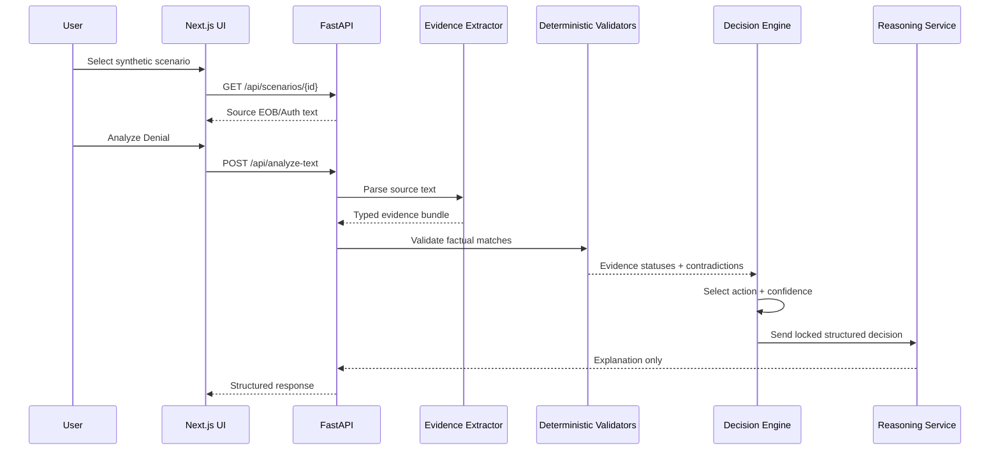
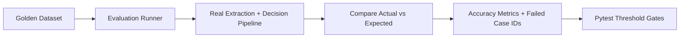
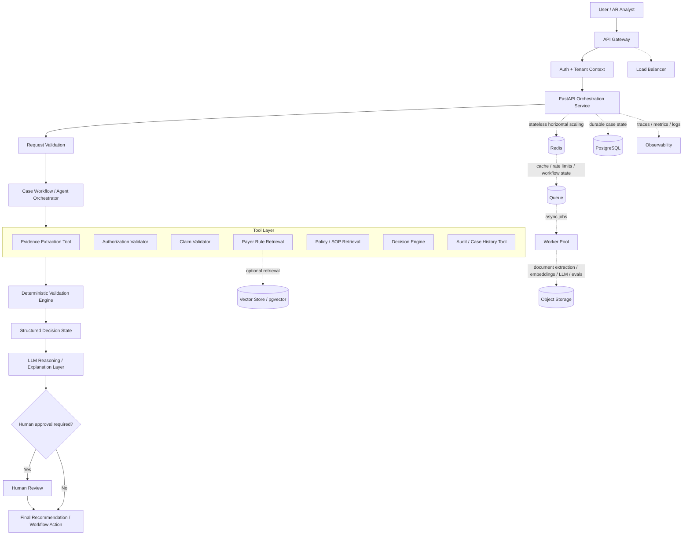
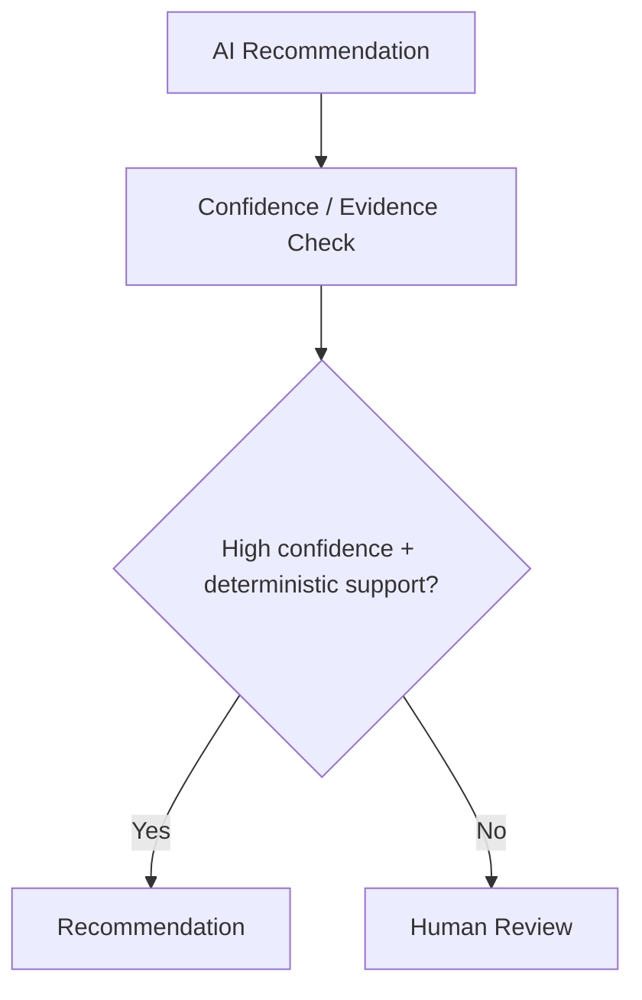

# Architecture

## System Overview

Denial Navigator AI is a local demo application for analyzing synthetic `CO-197` authorization denials. It separates factual validation from AI-generated explanation so that recommendations are based on deterministic evidence checks.

The current system has two apps:

- `apps/web`: Next.js demo UI
- `apps/api`: FastAPI service for extraction, validation, reasoning, and evaluation

No production database, uploaded documents, OCR service, RAG service, MCP server, or external payer integration is included.

## Components

### Next.js Frontend

The frontend lets a reviewer select a synthetic scenario, view source EOB/auth text, run analysis, and inspect extracted evidence, validation results, contradictions, missing evidence, recommendation, confidence, human-review status, and reasoning source.

### FastAPI API

The API exposes:

- `GET /api/health`
- `GET /api/scenarios`
- `GET /api/scenarios/{scenario_id}`
- `POST /api/analyze-denial`
- `POST /api/analyze-text`

### Evidence Extractor

The extractor parses labelled synthetic text into typed Pydantic models. It records source fields and fails safely when required fields are missing or malformed.

### Typed Evidence Bundle

The evidence bundle carries extracted claim fields, extracted authorization fields, source names, and confidence for field presence. This lets the UI show what was extracted before the decision engine runs.

### Deterministic Validators

The validators compare:

- patient identity
- member ID
- payer
- provider NPI/name
- authorization number presence
- CPT/service
- date of service against authorization effective dates

These checks produce matched, mismatched, or missing statuses.

### Decision Engine

The decision engine classifies supported denial families, evaluates validation results, detects contradictions, calculates deterministic confidence, and selects the recommended action.

Unsupported denial families return `supported: false`, `manual_review`, and `requires_human_review: true`.

### Reasoning Service

The reasoning service produces the final explanation. In deterministic mode, it uses the decision engine's summary. In optional LLM mode, it can summarize already-validated facts, but it cannot modify structured decision fields.

## Data Flow



## Deterministic vs AI Responsibilities

Deterministic code owns:

- date parsing
- authorization date range checks
- CPT matching
- payer matching
- provider matching
- member matching
- missing evidence detection
- contradiction detection
- confidence scoring
- recommended action
- human-review routing

AI owns only:

- optional natural-language summary of already-validated facts

If AI reasoning fails, the system falls back to deterministic reasoning.

## Trust Boundaries

The source text is untrusted input. It is parsed into Pydantic models before analysis.

The LLM output is also untrusted. It is schema-validated and only allowed to provide `reasoning_summary`. Structured decision fields are not accepted from the LLM.

Logs should not contain raw documents, patient names, member IDs, authorization numbers, or raw claim IDs.

## Failure Handling

Safe failure behavior includes:

- malformed request -> 422
- empty source text -> 422
- missing EOB -> 422
- required extraction field missing -> 422
- malformed dates -> 422
- unsupported denial code -> `supported: false` manual review
- LLM timeout/error/malformed response -> deterministic fallback

## Evaluation Flow



The evaluation runner uses the real application pipeline. It does not duplicate decision rules.

## Security Considerations

- Synthetic data only
- No `.env` committed
- No private repository history
- No uploaded documents
- No generated PDFs
- No production DB/vector store
- No raw document logging
- No PHI/PII in fixtures
- Optional LLM mode requires a user-provided key

## Design Tradeoffs

The demo favors clarity and safety over production breadth. It supports one denial family deeply, uses labelled synthetic text instead of OCR, and keeps infrastructure local. That makes the project easier for an interviewer to inspect and easier to evaluate deterministically.

## Production AI / Agentic Architecture

Proposed production evolution — not implemented in the challenge demo.

The current implementation is intentionally deterministic-first. A production system could add an LLM/agent orchestration layer around the deterministic validation engine while preserving the rule that validated facts and recommended actions are not directly mutated by the LLM.



## Agent Design

Proposed production evolution — not implemented in the challenge demo.

A production agent should not freely decide everything. It should choose from approved tools and follow a bounded workflow:

```txt
Analyze claim
-> check required evidence
-> retrieve payer policy if required
-> call authorization validator
-> call claim validator
-> inspect contradictions
-> produce recommendation
-> human approval for risky or uncertain cases
```

Guardrails:

- bounded tool calling
- explicit state machine or workflow graph
- maximum iteration limit
- maximum tool-call budget
- per-step timeout and run timeout
- no infinite loops
- deterministic terminal states
- human escalation when evidence, policy, retrieval, or tools are uncertain

LangGraph or similar orchestration could be used for this workflow, but this challenge demo does not implement it.

## Scaling Architecture

Proposed production evolution — not implemented in the challenge demo.

Production scaling would separate interactive API work from long-running extraction, retrieval, and AI work:

```txt
Client
-> Load Balancer / API Gateway
-> Stateless FastAPI instances
-> Redis
   -> cache
   -> rate limiting
   -> short-lived workflow state
-> Queue
-> Worker Pool
   -> document extraction workers
   -> embedding workers
   -> LLM workers
   -> evaluation / batch workers
-> PostgreSQL
-> Object Storage
-> Vector Store / pgvector
```

Scaling principles:

- FastAPI instances remain stateless and horizontally scalable.
- Long-running document and AI jobs move to queues.
- Workers autoscale by queue depth and latency.
- Redis supports per-tenant rate limits and safe reusable retrieval caches.
- PostgreSQL uses connection pooling for durable case state and audit records.
- Async I/O handles external API latency.
- Embeddings are batched where possible.
- LLM calls use concurrency limits, token budgets, and backpressure.
- Partial outages degrade gracefully to deterministic fallback or human review.

## Failure Handling Matrix

Proposed production evolution — not implemented in the challenge demo.

| Failure | Handling | Safe Outcome |
| --- | --- | --- |
| LLM timeout | Retry with exponential backoff and jitter | Fallback deterministic explanation; never lose validated decision |
| LLM malformed JSON | Schema validation, retry once | Fallback deterministic explanation |
| Tool failure | Bounded retry and mark tool failure | Do not hallucinate tool result; escalate when needed |
| Payer retrieval unavailable | Do not infer policy | Human review |
| Vector DB unavailable | Skip unverified retrieval | Human review or deterministic fallback |
| Queue failure | Retry and dead-letter queue | Case remains auditable |
| Duplicate request | Idempotency key | Avoid duplicate workflow actions |
| External API rate limit | Exponential backoff with jitter | Delay or human-review queue |
| Agent loop | Max steps, time budget, tool-call budget | Terminate and escalate |
| Partial system outage | Circuit breaker | Degraded deterministic mode or safe failure |
| Database unavailable | Fail safely | No unsupported recommendation |

Production reliability should also include health checks, readiness probes, liveness probes, timeouts at every external boundary, circuit breakers, idempotency records, and dead-letter handling for failed background jobs.

## AI Evaluation Strategy

Proposed production evolution — not implemented in the challenge demo.

### Extraction Evaluation

- field-level precision
- field-level recall
- exact match
- date extraction accuracy
- CPT extraction accuracy
- authorization number accuracy

### Retrieval Evaluation

If RAG is introduced:

- Recall@K
- Precision@K
- MRR
- NDCG
- metadata-filter accuracy
- citation coverage

### Decision Evaluation

- action accuracy
- human-review accuracy
- contradiction detection
- missing-evidence detection
- false-safe-action rate

False-safe-action rate should receive special attention because confidently recommending an incorrect action is worse than escalating to a human.

### LLM Evaluation

- groundedness
- faithfulness
- hallucination rate
- citation correctness
- structured-output validity
- instruction following
- completeness

### Agent Evaluation

- task success rate
- correct tool selection
- unnecessary tool calls
- tool-call failure rate
- loop / timeout rate
- average steps per task
- human escalation accuracy

### Production Metrics

- p50/p95/p99 latency
- cost per claim
- tokens per claim
- LLM error rate
- tool failure rate
- escalation rate
- throughput
- queue depth

## CI/CD AI Evaluation Gates

Proposed production evolution — not implemented in the challenge demo.

AI systems should not be deployed just because unit tests pass. A production pipeline could look like:

```mermaid
flowchart LR
    Change[Code Change] --> Unit[Unit Tests]
    Unit --> Integration[Integration Tests]
    Integration --> Golden[Golden Dataset Evaluation]
    Golden --> Retrieval[Retrieval Evaluation]
    Retrieval --> LLMEval[LLM / Agent Evaluation]
    LLMEval --> Regression[Regression Comparison]
    Regression --> Safety[Safety Thresholds]
    Safety --> Deploy[Deploy]
```



Example gates, not production claims:

- deterministic unit tests = 100%
- no regression in golden action accuracy
- no increase in unsafe action rate
- structured output validity above a defined threshold
- retrieval Recall@K above approved baseline
- hallucination/groundedness not worse than approved baseline
- latency and cost within an acceptable budget

## Observability

Proposed production evolution — not implemented in the challenge demo.

Production tracing should connect:

```txt
Request
-> Trace ID
-> Agent run
-> Tool calls
-> Retrieval
-> LLM request
-> Decision
-> Human override
```

Track:

- trace ID
- tenant ID
- model name/version
- prompt version
- rule version
- retrieval document IDs
- tool calls
- latency
- token usage
- decision
- confidence
- human override

OpenTelemetry-style distributed tracing would be a reasonable production option. Logs and traces should avoid PHI and raw patient content unless there is a controlled, audited reason to retain it.

## Model / Prompt Versioning

Proposed production evolution — not implemented in the challenge demo.

Production AI decisions must be reproducible. Each decision record should persist:

- model version
- prompt version
- rule-set version
- retrieval index version
- evidence used
- decision generated
- timestamp

This makes it possible to audit why a claim received a recommendation and to reproduce behavior after model, prompt, or rule changes.

## Multi-Tenancy And Security

Proposed production evolution — not implemented in the challenge demo.

Production requirements would include:

- `tenant_id` on every request
- tenant-scoped database queries
- tenant-scoped vector retrieval
- RBAC
- authentication
- encryption in transit and at rest
- secrets manager
- PHI-safe logging
- audit trails
- least privilege for workers, tools, and external APIs

## Human-In-The-Loop

Proposed production evolution — not implemented in the challenge demo.

The system should escalate rather than guess when evidence is missing, evidence contradicts, payer policy is unavailable, retrieval confidence is weak, the denial type is unsupported, an agent/tool fails, or the recommendation is high-risk.



## Cost Control

Proposed production evolution — not implemented in the challenge demo.

Cost controls:

- deterministic rules before LLM calls
- small model for extraction/classification when appropriate
- expensive model only for difficult reasoning
- semantic cache where safe
- prompt and context trimming
- top-k retrieval controls
- batch embeddings
- token budgets
- per-tenant quotas
