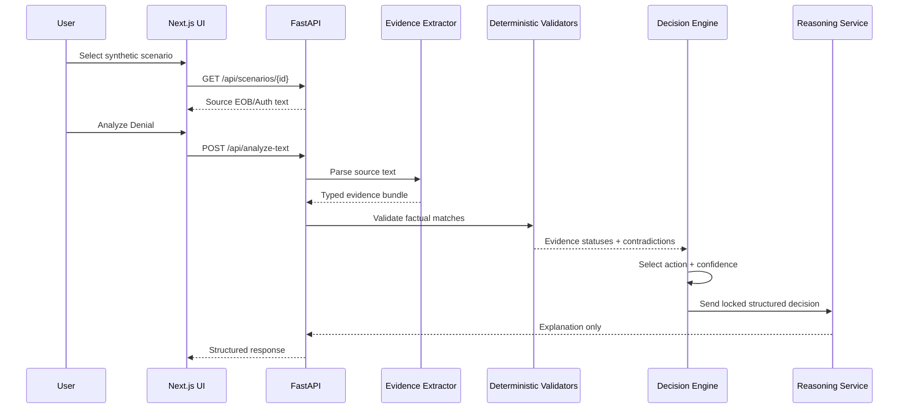

# Architecture

## System Overview

Denial Navigator AI is a local demo application for analyzing synthetic `CO-197` authorization denials. It separates factual validation from AI-generated explanation so that recommendations are based on deterministic evidence checks.

The current system has two apps:

- `apps/web`: Next.js demo UI
- `apps/api`: FastAPI service for extraction, validation, reasoning, and evaluation

No production database, uploaded documents, OCR service, RAG service, MCP server, or external payer integration is included.

## Components

### Next.js Frontend

The frontend lets a reviewer select a synthetic scenario, view source EOB/auth text, run analysis, and inspect extracted evidence, validation results, contradictions, missing evidence, recommendation, confidence, human-review status, and reasoning source.

### FastAPI API

The API exposes:

- `GET /api/health`
- `GET /api/scenarios`
- `GET /api/scenarios/{scenario_id}`
- `POST /api/analyze-denial`
- `POST /api/analyze-text`

### Evidence Extractor

The extractor parses labelled synthetic text into typed Pydantic models. It records source fields and fails safely when required fields are missing or malformed.

### Typed Evidence Bundle

The evidence bundle carries extracted claim fields, extracted authorization fields, source names, and confidence for field presence. This lets the UI show what was extracted before the decision engine runs.

### Deterministic Validators

The validators compare:

- patient identity
- member ID
- payer
- provider NPI/name
- authorization number presence
- CPT/service
- date of service against authorization effective dates

These checks produce matched, mismatched, or missing statuses.

### Decision Engine

The decision engine classifies supported denial families, evaluates validation results, detects contradictions, calculates deterministic confidence, and selects the recommended action.

Unsupported denial families return `supported: false`, `manual_review`, and `requires_human_review: true`.

### Reasoning Service

The reasoning service produces the final explanation. In deterministic mode, it uses the decision engine's summary. In optional LLM mode, it can summarize already-validated facts, but it cannot modify structured decision fields.

## Data Flow

## Deterministic vs AI Responsibilities

Deterministic code owns:

- date parsing
- authorization date range checks
- CPT matching
- payer matching
- provider matching
- member matching
- missing evidence detection
- contradiction detection
- confidence scoring
- recommended action
- human-review routing

AI owns only:

- optional natural-language summary of already-validated facts

If AI reasoning fails, the system falls back to deterministic reasoning.

## Trust Boundaries

The source text is untrusted input. It is parsed into Pydantic models before analysis.

The LLM output is also untrusted. It is schema-validated and only allowed to provide `reasoning_summary`. Structured decision fields are not accepted from the LLM.

Logs should not contain raw documents, patient names, member IDs, authorization numbers, or raw claim IDs.

## Failure Handling

Safe failure behavior includes:

- malformed request -> 422
- empty source text -> 422
- missing EOB -> 422
- required extraction field missing -> 422
- malformed dates -> 422
- unsupported denial code -> `supported: false` manual review
- LLM timeout/error/malformed response -> deterministic fallback

## Evaluation Flow

The evaluation runner uses the real application pipeline. It does not duplicate decision rules.

## Security Considerations

- Synthetic data only
- No `.env` committed
- No private repository history
- No uploaded documents
- No generated PDFs
- No production DB/vector store
- No raw document logging
- No PHI/PII in fixtures
- Optional LLM mode requires a user-provided key

## Design Tradeoffs

The demo favors clarity and safety over production breadth. It supports one denial family deeply, uses labelled synthetic text instead of OCR, and keeps infrastructure local. That makes the project easier for an interviewer to inspect and easier to evaluate deterministically.
